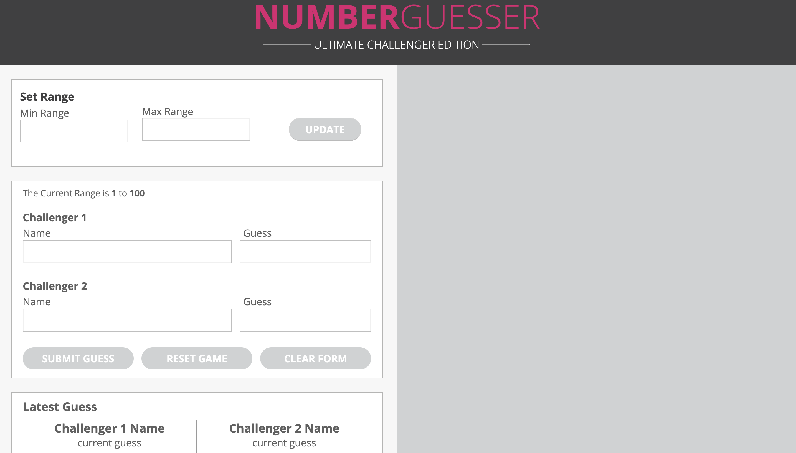
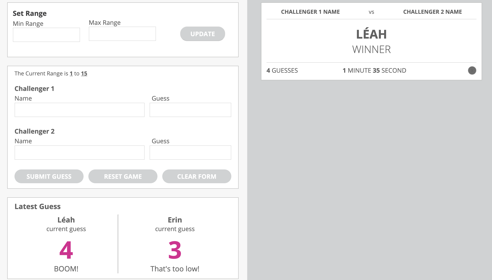

# Number-Guesser-Project

This project was assigned to myself (Léah Winters) and to Erin Campbell, through our school: Turing School of Software and Design. We are Module 1 students, so we are brandnew to coding. In this project, we made a number guesser game website. 

When playing the game, you and another person decide on and enter the range (a min and a max number) into an input feild. When you click the update button, the game randomly generates a number between your set values. Both people then enter their name and what they think is the correct number. After clicking the submit button, the game will tell each player if their guess was too high, too low, or spot on. The game also keeps track of how many guesses it took both players to get to the correct answer. 

It's a simple and fun game that helped us both learn so much!

## The photo below shows a screen shot of the game when you first load it up:

## The screen shot below shows a screen shot of the game after a player has won the game:

 
